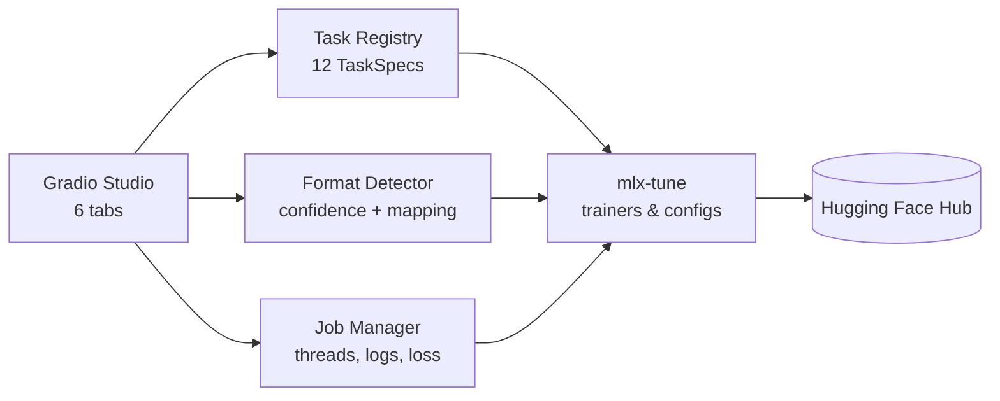

<div align="center">

# 🎛️ Finetuner Studio

**Low-code fine-tuning on Apple Silicon — load a model, drop a dataset, press train.**

Powered by [mlx-tune](https://github.com/ARahim3/mlx-tune) · Built with [Gradio](https://gradio.app)


*Türkçe özet için [aşağıya](#-türkçe-özet) bakın.*

</div>

---

Fine-tuning LLMs on a Mac is finally practical — but it still means writing
Python. **Finetuner Studio** removes the boilerplate: every training paradigm
that [mlx-tune](https://github.com/ARahim3/mlx-tune) supports is reachable
from a six-tab GUI, your dataset's format is **detected automatically**, and
when you outgrow the GUI it hands you a clean, standalone Python script.

## ✨ Highlights

- **12 training paradigms, one interface** — SFT, DPO, ORPO, SimPO, KTO,
  GRPO, Continual Pretraining, Vision-Language SFT, TTS, STT, Embeddings, OCR.
- **Models from anywhere** — search the Hugging Face Hub (MLX-biased) or point
  at a local converted model directory.
- **Datasets from anywhere** — Hub search, local path, or drag-drop upload
  (`.jsonl`, `.json`, `.csv`, `.tsv`, `.parquet`).
- **🔎 Automatic format detection** — Alpaca, ShareGPT, ChatML,
  prompt/completion, preference pairs, KTO feedback, raw text, embedding
  pairs, audio+text, image+text, vision chat… classified with a confidence
  score, column mapping, and the list of compatible trainers. Synonyms work:
  a `question/answer` CSV just trains.
- **Live training** — background jobs, streaming logs, a real-time loss
  curve, and a stop button.
- **💬 Playground** — chat with the model before and after tuning.
- **📦 Exports** — LoRA adapters, merged fp16, GGUF (llama.cpp/Ollama), or
  push straight to your Hugging Face account.
- **🧾 Low-code, not no-code** — one click generates the standalone mlx-tune
  Python script for the exact run you configured. mlx-tune's API is
  Unsloth-compatible, so the same script moves to a cloud GPU unchanged.
- **📜 Recipes** — save/load entire runs as shareable YAML.

## 🚀 Quickstart

```bash
# Apple Silicon Mac, Python 3.10+
pip install -e '.[mlx]'      # from a clone of this repo
finetuner                    # opens http://127.0.0.1:7860
```

Then walk the tabs:

```
🧠 Model  →  📚 Dataset  →  🚀 Train  →  📈 Monitor  →  💬 Playground  →  📦 Export
```

1. **Model** — search e.g. `llama 3.2 instruct 4bit`, keep LoRA defaults, ⚡ Load.
2. **Dataset** — try `examples/alpaca_sample.jsonl` (drag & drop) or any Hub
   dataset. Watch the detector announce the format and mapping.
3. **Train** — 🏁 Start. Or press **🧾 Generate Python script** first to see
   exactly what will run.
4. **Monitor** — loss curve and logs update every 2 seconds.
5. **Playground** — talk to your freshly tuned model.
6. **Export** — save adapters or `🤗 Push to Hub`.

> **No Apple Silicon?** The Studio still launches in *GUI-only mode* for
> dataset inspection, recipe authoring, and script generation.

## 🧭 How it works



The **task registry** (`finetuner/core/registry.py`) is the single contract
with mlx-tune: every loader/trainer/config class, dataset schema and default
lives in one table that drives the GUI, the detector, and the code generator
alike. Full design docs — written by the project's virtual software team —
live in [`docs/`](docs/TEAM.md): [PRD](docs/PRD.md) ·
[Architecture](docs/ARCHITECTURE.md) · [UX](docs/UX_DESIGN.md) ·
[Detection spec](docs/DATASET_DETECTION.md) · [Test plan](docs/TEST_PLAN.md) ·
[Roadmap](docs/ROADMAP.md).

## 🧪 Development

```bash
pip install -e '.[dev]'
pytest            # hermetic suite — no MLX required
ruff check .
```

## 🇹🇷 Türkçe Özet

**Finetuner Studio**, Apple Silicon Mac'lerde model ince ayarını (fine-tuning)
koda ihtiyaç duymadan yapmanızı sağlayan yerel bir stüdyodur. Arka planda
[mlx-tune](https://github.com/ARahim3/mlx-tune) çalışır; SFT'den DPO'ya,
TTS'ten OCR'a 12 eğitim yöntemi tek arayüzdedir. Hugging Face'ten veya yerel
diskten model/veri kümesi yükleyin — **veri kümesi formatı otomatik algılanır**
(Alpaca, ShareGPT, tercih çiftleri, ses+metin…). Eğitimi canlı kayıp grafiğiyle
izleyin, modelle sohbet edin, sonucu GGUF'a aktarın ya da Hugging Face
hesabınıza gönderin. Görsel olarak kurduğunuz her eğitim, tek tıkla bağımsız
bir Python betiğine dönüşür.

## License

MIT © 2026 Aykut Çayır. Training backend by
[ARahim3/mlx-tune](https://github.com/ARahim3/mlx-tune).
