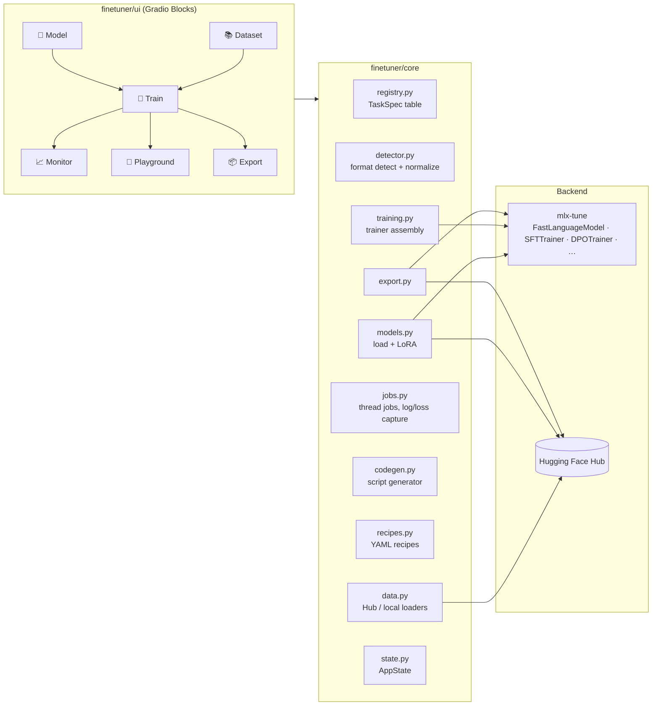

# Architecture — Finetuner Studio

*Owner: Software Architect*

## System overview

## Key decisions

### ADR-1 · Single source of truth: the task registry
Every mlx-tune paradigm is one `TaskSpec` row (loader, trainer, config class,
collator, dataset schema, defaults, modality). The GUI builds its dropdowns
from it, codegen renders scripts from it, the detector maps formats to it.
Adding a future mlx-tune trainer = adding one registry entry.

### ADR-2 · Lazy backend imports
`mlx_tune` is imported only inside `registry.resolve()`. Consequences:
the package imports cleanly on Linux/CI; tests for detection, codegen,
recipes and jobs need no MLX; the GUI reports a clear "GUI-only mode" banner
when MLX is unavailable.

### ADR-3 · Version-drift tolerance
mlx-tune evolves quickly. Defensive seams:
- config kwargs are filtered against the target dataclass's fields
  (`training._filtered_kwargs`);
- trainer construction retries with `tokenizer` ↔ `processor` swapped;
- `apply_lora` drops unsupported kwargs on `TypeError`.

### ADR-4 · Training as captured-stdout jobs
mlx-tune has no public callback API, so the job runner redirects
stdout/stderr into a ring buffer and parses `loss`/`step` with regexes
(`jobs._LOSS_RE`). This is deliberately decoupled: if mlx-tune grows
callbacks, only `training.run_training` changes.

### ADR-6 · One persistent MLX engine thread
MLX streams are **thread-local**: a model loaded on one (transient Gradio
handler) thread cannot be trained or sampled from another — native training
fails with *"There is no Stream(gpu, N) in current thread"*. Discovered live
while driving the GUI with Playwright. All MLX work (load, LoRA, train,
generate) is therefore funneled through a single long-lived engine thread
(`core/engine.py`, `ENGINE.call`). Side benefit: GPU work is serialized,
which is the right policy on a single-device machine. The engine module also
prepends the interpreter's bin dir to `PATH` so mlx-tune's `mlx_lm.lora`
subprocess fallback works even when the venv isn't activated.

### ADR-5 · Module-level state, single user
The Studio is a local single-user tool; `state.STATE` and `jobs.MANAGER` are
process-global. A multi-user server would replace these with per-session
state — isolated behind two small modules by design.

## Data flow of one training run

1. **Model tab** → `models.load_model()` → `FastXModel.from_pretrained` →
   optional `get_peft_model` → handles stored in `AppState`.
2. **Dataset tab** → `data.load_*()` → `detector.detect(rows)` → `Detection`
   (format, confidence, mapping, compatible tasks) shown to the user.
3. **Train tab** → `RunConfig` assembled → `detector.normalize()` reshapes
   rows to the task schema (chat-templating via the live tokenizer) →
   `jobs.MANAGER.submit(run_training, …)`.
4. **Monitor tab** → `gr.Timer(2s)` polls the job's log buffer and metric
   list; loss is charted with `gr.LinePlot`.
5. **Export tab** → `model.save_pretrained[_merged|_gguf]` / `push_to_hub`.

## Threading model

| Thread | Work |
|---|---|
| Gradio event handlers | dataset IO, codegen, recipes; MLX calls forwarded to the engine |
| `finetuner-mlx-engine` (singleton) | **all MLX work**: model load, LoRA, `trainer.train()`, generation (ADR-6) |
| `finetuner-job-N` daemon threads | own the stdout tee + job bookkeeping; block on `ENGINE.call` |
| Gradio timer | read-only snapshots of job state |

Job state mutation is single-writer (the job thread); the UI only reads, so
no locks are needed beyond the manager's id allocation lock. The stdout
redirect is process-wide, so engine-thread prints still land in the
requesting job's log buffer.
